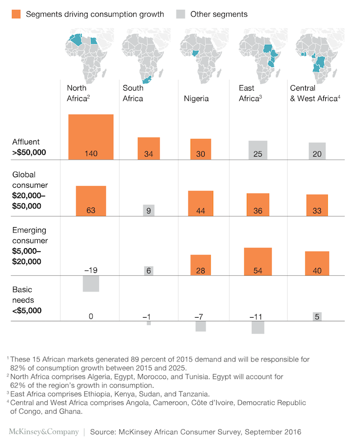
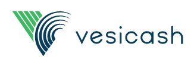
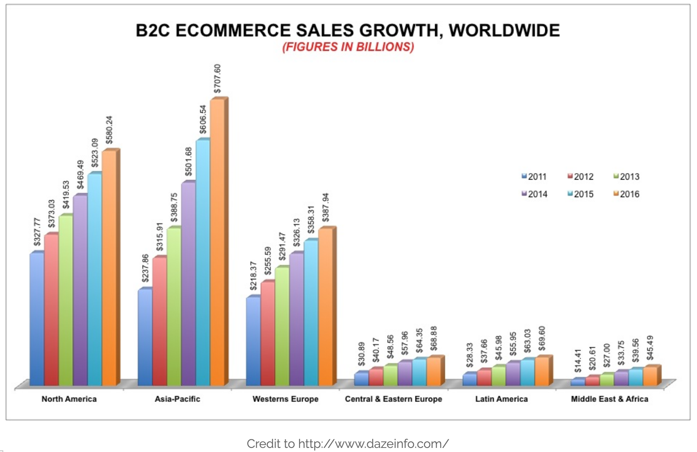
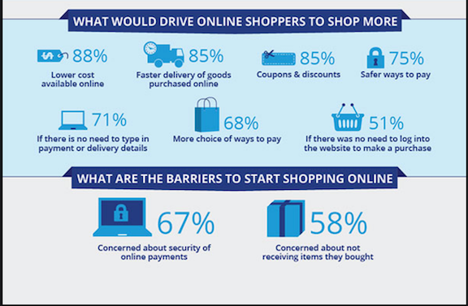
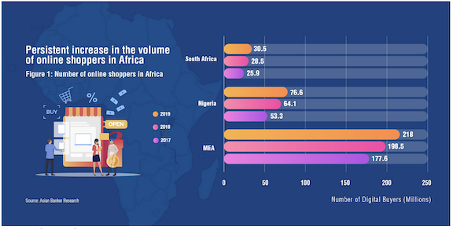
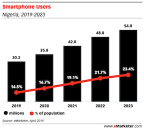

# VesiCash:  Caveat emptor no more

## Investment Thesis
* Digital escrow expected to drive growth of e-commerce.  Despite a high internet and smartphone penetration into Nigeria, online sales have lagged, with a lack of trust between buyer and seller often cited as a principal reason (1).  Digital Escrow helps derisk both parties, by assuring the seller of future payment, but locks up that payment until the buyer receives and is satisfied with the authenticity of the  goods.  We believe this technology would help to drive adoption of e-commerce in Africa, similar to AliPay increasing the confidence of Chinese consumers in the integrity of BABA’s platform.  While there are several escrow players in Nigeria but we believe they can all be supported in the market by the significant growth potential in the online customer base. In Africa.   

* A one stop shop for third party payment solutions can drive adoption and retention of users. Fundamentally, digital escrow provides a risk mitigated approach to money transfers by acting as a gate point between the parties, and we expect they could leverage their existing architecture to also provide classical B2C payment services similar to PayPal or P2P money transfers similar to Venmo.  Also, in Nigeria and much of Africa, more than half of the population is unbanked(2), and  we believe offerince mobile wallet services, would synergize with both their broader payment platform to make the Vesicash a one stop shop for all payment needs.  

* Expansion throughout Western Africa will increase the addressable population and expand throughout africa.  Nigeria is Africas’ largest economy, but e-commerce has been growing throughout western Africa, with not just in the affluent population but also the emerging middle class (3). We believe the same trust issues which have hindered e-commerce are present in these other emerging markets.  Since their service should easily slots into existing payment paradigm, a priori, we believe it would be relatively simple to expand their geographic footprint.  

## Overview and Origin

* Name:  Vesicash Financial Technology
 

* incorporated May 14, 2018 in Lagos, Nigeria

* Founders: Aigiomawu Ehiaghe, Ibrahim B. Oladele, Tomisin Adeshiyan (4)

* Company origin:  As students at the Meltwater Entrepreneurial School of Technology, the founders looked at pain points for the growth of e-commerce in Nigeria.  The founders realized everyone they knew had been a victim of online fraud, which led them to founding a company which would enforce a level of trust between buyers and sellers.  After further researching different approaches, they settled on digital escrow.(5)  

* Funding:  The initial pre-seed capital of 100k USD, which allowed Vesicash to initiate operations was obtained by both self funding (~20k USD) and from an investment from the founder’s entrepreneur program, The Meltwater Entrepreneurial School of Technology (6self funded,4).  The company  is now a VC backed company with the closed of their seed round of financing with Ingressive Capital as the lead investor on February 21, 2020.  While the size of this round has not been disclosed, we believe it at least doubled their amount raised, since Ingressive’s minimum check size is 100k USD (6).

## Business Activities

* Fintech solution: In developed countries ecommerce has revolutionized how we shop.  With the convenience of being able to buy everything from take-out from our favorite restaurant while on our way home on the subway to the real estate that we call home, there is not one area of commerce unaffected and in the two largest markets of North America and Asia, online revenues amounted ~1.288T USD.  Other geographies, though, have not seen the same astronomical flux through the online channel, and with revenues of 45B USD, e-commerce in Africa is only ~8% of North America (7).

Commerce depends on trust with buyers wanting to know they are getting value for money and sellers expecting they will be paid for their merchandise.  The legal principle of Caveat emptor, quia ignorare non debuit quod jus alienum emit ("Let a purchaser beware, for he ought not to be ignorant of the nature of the property which he is buying from another party” has been part of common law since Roman time and basically says that the buyer is obligated to do their diligence, to try equalizing the asymmetry of information before the transaction is finalized.  This diligence and building of trust was much easier in a physical market place when transactions were done face to face, but in the digital sphere diligence is nearly impossible (how many of us can trust any review of a potential restaurant, fearing they were either written by management or by competitors?).   In the developing world this lack of trust is compounded by loser consumer protections or lack of options for redressing grievances, and nearly every Nigerian either has been the victim of fraud or knows someone who has (5).  We believe this lack of trust in ecommerce is a major factor which has retarded the growtn of ecommerce in Africa as illustrated by a survay showing 58% of potential online shoppers are concerned about recieving the good for which they paid (1). 

Initial attempts to combat online scams involved payment being due on delivery.  This had the unintended effect of putting all the risk on the seller and nearly 75% of transactions are either underpaid or not paid at all (5).  In this environment, a new crop of African entrepreneurs have chosen to leverage the lessons learned during the growth of BABA in Asian.  When BABA was founded in 1999, they also had to fight a lack of trust in online shopping due to the chinese market being rife with fraud and counterfeit goods.  Their solution was to launch the payment and digital escrow service, AliPay, in 2003, which was successful in boosting sales through their platform (8).        
Digital escrow is a simple concept.  The escrow service acts as an impartial referee sitting in the payment channel between the buyer and seller.  Using the escrow service, at the time of transaction, the buyer submits their full payment for the goods or services.  Rather than being directly transferred to the seller, they are held in the virtual safekeeping of the escrow service, who notifies the seller of the receipt of the funds.  With the knowledge that they will receive full payment, the seller ships their goods to the buyer.  Once the Buyer receives and accepts the goods, the funds are then released to the seller completing the sale.  
* This paradigm protects both the buyer and seller.

    - The escrow service uses a secure payment service, protecting the buyers financial information.
    - Since payment is given upfront, the buyer is confident that they will be paid in full upon acceptance of the goods.
    - Once the goods are received by the buyer, they are able to conduct their diligence, giving them confidence in the legitimacy of the good, satisfying Caveat emptor.
    - By using a fintech approach, this entire payment and release process can be automated and streamlined for a seamless user experience as well as low cost. (9)
   

* Who is the company's intended customer?  Nigeria has 190 million people of which 40% are online (10).   Since 2017 there has been a 20% CAGR in the number of online purchases, reaching 77 million in 2019 (11), which we believe are a mix of first time and recurrent internet shoppers.  With a product like Vesicash, the goal would be to give the first time users a problem free experience, which will drive their conversion to recurrent users, and loyal Vesicash customers. 

In Nigeria 30m individules have smart phones and this population is expected to increase at a 13% CAGR (10).  A good predictor of online shopping habits is the possession of a smartphone.  In one survey, 90% of smart phone have used their phone for online shopping, with 51% using their phone for at least one purchase a month (12).  As the growth of smartphones continues to increase so will these consumers, so any product Vesicash offers, needs to be compatible with mobile platforms.  

* Technologies used:  Vesicash's solution is a simple PHP plugin that sits within the Woocommerce platform, leveraging their secure payment infrastructure (13). 

## Landscape

* Domain:  Payment and ecommerce space.

* Domain innovations: The greatest innovations in the escrow space have come from the advent of blockchain facilitated smart contracts, which prevents both parties from claiming ignorance of the deal.  A greater shift has occured in the broader payment landscape has been much more pronounced.  These shifts are illustrated by the innovation coming out of companies like Venmo (peer to peer money transfer) and Square or Stripe (development of a lightweigth API allowing sellers to conduct mobile or web based transactions without the need for an issuing or aquiring bank).(14)  We believe the most significant innovations currently reaching the mainstream are e-wallets and alternative financing options.  Also on the horizon we expect voice payment using smart speakers and facilitate by AI wallet solutions.(15) 
  
* Performance compared to peer group:  Digital escrow is a young space and Vesicash and their competitors are all very young startups, with little data in the public domain.  We believe they are fairly competitive with their peer group. In the first year of operations Middletrust signed up 20 merchants (16), which in an interview, the Vesicash CEO claimed to have signed up 60 merchants in the first 9 months of operations (7).  Also both Escrow Kenya and VesiCash claim to have signed up thousands of customers, but Escrow Kenya has processed ~81K USD in transactions over 1.5 years (17) compared to Vesicash processing 20K USD in the first year, but we believe part of this difference arises from 73% of Kenyans using mobile money compared to only 6% in Nigeria, giving the unbanked much more access to online shopping (18)  

## Recommendations:

* Recommendations for expanding their offerings:  We would recommend Vesicash to off a full suite of payment services, including P2P, non-escrowed C2B (ala PayPal) and most importantly in the largely unbanked African population, e-wallets or potentially alternative financing.  

* Rationale for additional offerings:  We believe as an escrow service, Vesicash sits in the payment channel shepherding the flow of cash, agnostic to either buyer or seller.  Escrow and the trust it affords, we believe is more vital for larger ticket items or fashion/electronics, where counterfits are ubiquitous.  Other smaller, more everyday purchases do not require escrow, but involve the same counterparties and would cement vesicash in the mind of customers as a reliable and trusted (read go to) solution for online payments. Much of Africa is unbanked, offering an e-wallet or alternative financing options would bring this large addressable pool of customers into the digital sphere , boosting overall ecommerce ecosystem.

* Utilized technologies: Vesicash's current solution is a simple PHP plugin that sits within the Woocommerce platform and we believe to achieve our recommendations a significant buildout would be required.  In interviews, the CEO of Vesicash has liked as having the ability to provide the same boost to ecommerce in Africa as AliPay provided in China(7). We would take that analogy farther and say to successufully achieve our recommendations they will need a tech stack very similar to AliPay(18).  According to Github, AliPay uses a mixture of Java, C++, JavaScript, Rust, and C# based approaches.        

* Why are these technologies appropriate for your solution?  We believe there is no need for Vesicash to reinvent the wheel.  The technologies for all the offerings we propose (escrow, B2C payment, P2P payment, and e-wallets) have already been developed and validated in the larger and more competitive markets of North America and Asia.  Now it just comes down to using those technologies in this new geography.  Java appears to be a favorite for backend webdevelopment, with well validated tools and protocols.  While Javascript is the favorite front end technoogy.  Fundamentaly, whatever technology Vesicash chooses would need to support PCI DSS complient protocols for security of all cash flows through the system, which is now being handled by the Woocommerce platform.  AliPay has begun using machine learning and AI, to review payment disputes and Python seems to to be the favorite of data scientist, so a place for Python development is also possible as ecommerce moves forward.  The only real hurdle is making consumers aware of these solutions and making them loyal Vesicash customers.      

### References:
[1](http://www.techsmart.co.za/business/PayPal-identifies-drivers-and-barriers-for-local-e-commerce-landscape.html) PayPal Identifies drivers and barriers for local e-commerce landscape, Techsmart.co.za, Nov 2015

[2](http://finclusion.org/country/africa/nigeria.html#dataAtAGlance)  Nigeria, Finclusion.org

[3](https://www.mckinsey.com/industries/consumer-packaged-goods/our-insights/lions-still-on-the-move-growth-in-africas-consumer-sector) Lions (still) on the move: Growth in Africa’s consumer sector, McKinsey&Company, Oct 2017

[4](https://www.crunchbase.com/organization/vesicash-financial-technology#section-funding-rounds)  Vesicash, Crunchbase.com

[5](https://www.pymnts.com/news/payments-innovation/2019/african-ecommerce-boost-digital-escrow/ ) Vesicash Uses Escrow To Ignite eCommerce In Africa, PYMNTS.com, July 2019

[6](https://ventureburn.com/2020/02/nigerian-fintech-vesicash-investment/) Nigerian fintech Vesicash nets further investment from Ingressive Capital, Ventureburn.com, Feb 2020

[7](https://dazeinfo.com/2013/07/01/global-ecommerce-sales-2013-india-us-uk/)  Global Ecommerce Sales To Reach 1.22 Trillion USD In 2013: 70% To Come From APAC And America, July 2013

[8](https://www.cgap.org/research/publication/china-digital-payments-revolution) China: A Digital Payment Revolution, cgap.org, Setp 2019

[9](https://medium.com/@vesicash/what-is-escrow-and-how-does-it-work-332aecea1cf6) What is Escrow? And How does it work?, Medium.com, Mar 2019

[10](https://www.chandlernguyen.com/blog/2019/06/26/nigeria-media-landscape-2019/)  Chandler Nguyen, Nigeria media landscape 2019, chandlernguyen.com, June 2019 

[11](http://www.theasianbanker.com/updates-and-articles/nigeria,-south-africa-and-kenya-dominate-the-e-commerce-industry-in-sub-saharan-africa)  Faith Masekesa, Nigeria, South Africa and Kenya dominate the e-commerce industry in Sub-Saharan Africa, theasianbanker.com, Feb 2020

[12](https://www.tralac.org/news/article/7087-nigeria-is-africa-s-leading-ecommerce-market.html) Nigeria is Africa’s leading ecommerce market, Tralac.org, Mar 2015

[13](https://github.com/vesicash/woocommerce-plugin) Vesicash's GitHub Repository 

[4](https://www.forbes.com/sites/jordanmckee/2018/05/08/5-trends-reshaping-payments-in-2018/#6e25235138c9) Jordan McKee, 5 Trends Reshaping Payments In 2018, Forbes.com, May 2018

[15](https://medium.com/quick-code/5-most-innovative-digital-wallet-trends-of-2020-377fbb54eab4) Sandeep Agarwal, 5 Most Innovative Digital Wallet Trends of 2020, Medium.com, Nov 2019

[14](https://disrupt-africa.com/2019/08/how-nigerias-vesicash-is-making-digital-payments-more-secure/)  Tom Jackson, How Nigeria’s Vesicash is making digital payments more secure, Disrupt_africa.com, August 2019

[15](https://disrupt-africa.com/2019/07/nigerian-online-escrow-platform-middletrust-launches-in-priv) Tom Jackson, Nigerian online escrow platform Middletrust launches in private beta, Disrupt_africa.com, July 2019

[16](https://www.escrowkenya.com/) Kenya Escrow corporate page

[17](https://www.pymnts.com/financial-inclusion-3/2018/nigeria-decline-banked-adults-mobile-money-roadblocks/ ) Nigeria Sees Decline In Banked Adults Thanks To Mobile Money Roadblocks, Pymnts.com, July 2018

[18](https://github.com/alipay)  AliPay GitHub repository

